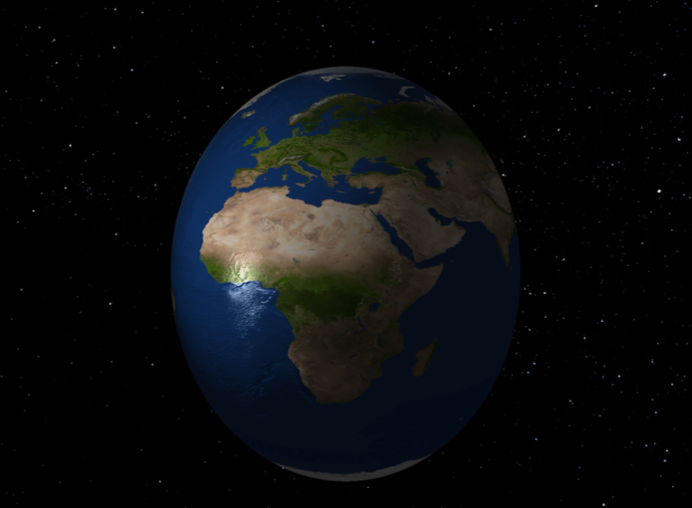
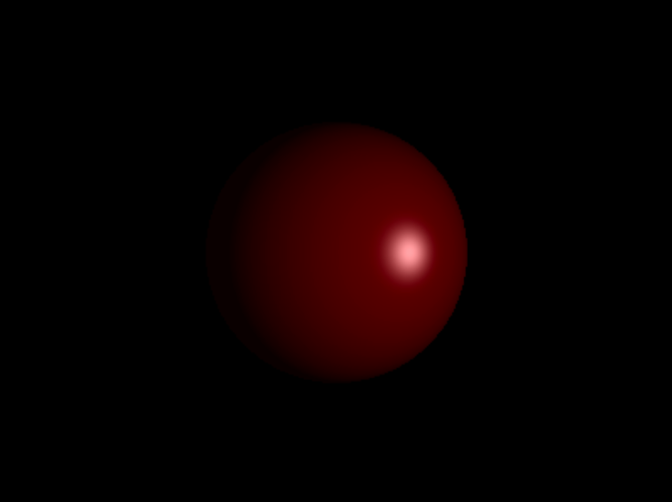
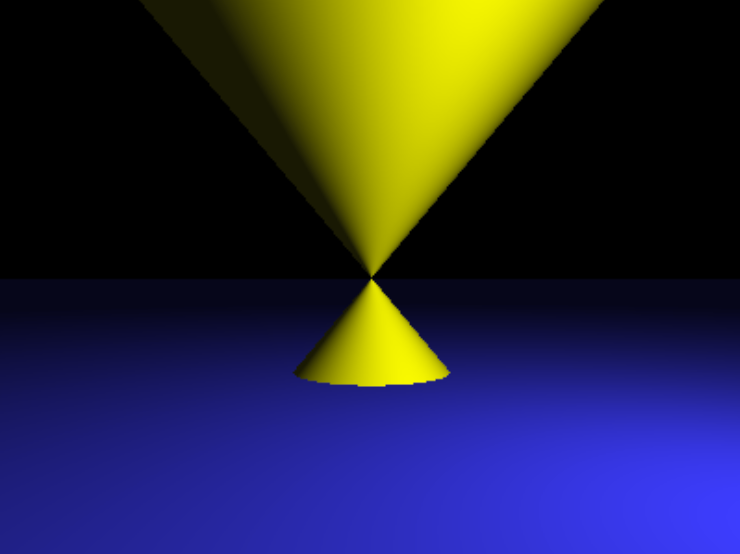
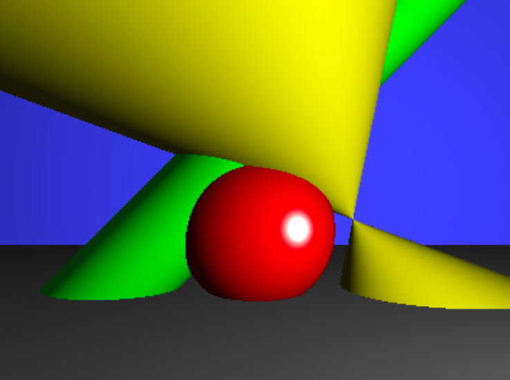
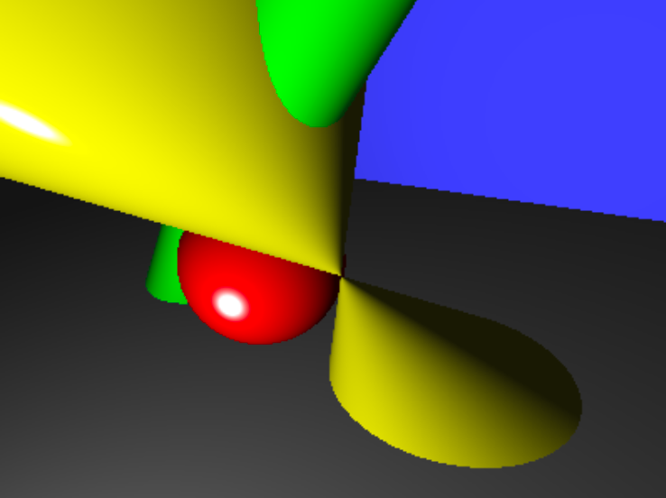
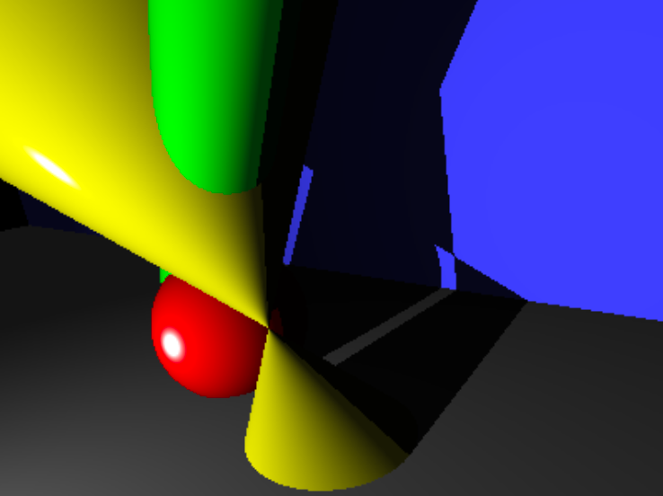
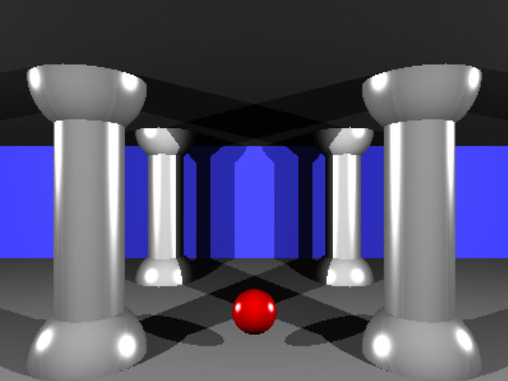
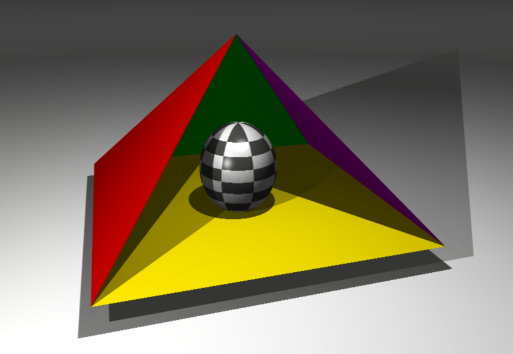

# miniRT

### My first RayTracer with miniLibX

>[!note]
>Summary:
>This project is an introduction to the beautiful world of Raytracing.
Once completed you will be able to render simple Computer-Generated-Images and you will never be afraid of implementing mathematical formulas again.
 Version: 8.2

## 0. Contents
---

1. Introduction
2. Common instructions
3. Mandatory part - miniRT
4. Bonus part
5. Examples
6. Submission and peer-evaluation

## 1. Instructions
---

When it comes to rendering 3-dimensional computer-generated images there are 2 possible approaches: “Rasterization”, which is used by almost all graphic engines because of its efficiency and “Ray Tracing.”

The “Ray Tracing” method, developed for the first time in 1968 (but improved upon since) is even today more expensive in computation than the “Rasterization” method. As a result, it is not yet fully adapted to real time use-cases but it produce a much higher degree of visual realism.


Figure I.1: The pictures above are rendered with the ray tracing technique. Impressive isn’t it?

Before you can even begin to produce such high-quality graphics, you must master the basics: the miniRT is your first ray tracer coded in C, normed and humble but functionnal.

The main goal of miniRT is to prove to yourself that you can implement any mathematics or physics formulas without being a mathematician, we will only implement the most basics ray tracing features here so just keep calm, take a deep breath and don’t panic! After this project you’ll be able to show off nice-looking pictures to justify the number of hours you’re spending at school...

## 2. Common Instructions
---

- Your project must be written in C.
- Your project must be written in accordance with the Norm. If you have bonus files/functions, they are included in the norm check and you will receive a 0 if there is a norm error inside.
- Your functions should not quit unexpectedly (segmentation fault, bus error, double free, etc) apart from undefined behaviors. If this happens, your project will be considered non functional and will receive a 0 during the evaluation.
- All heap allocated memory space must be properly freed when necessary. No leaks will be tolerated.
- If the subject requires it, you must submit a Makefile which will compile your source files to the required output with the flags -Wall, -Wextra and -Werror, use cc, and your Makefile must not relink.
- Your Makefile must at least contain the rules $(NAME), all, clean, fclean and re.
- To turn in bonuses to your project, you must include a rule bonus to your Makefile, which will add all the various headers, libraries or functions that are forbidden on the main part of the project. Bonuses must be in a different file _bonus.{c/h} if the subject does not specify anything else. Mandatory and bonus part evaluation is done separately.
- If your project allows you to use your libft, you must copy its sources and its associated Makefile in a libft folder with its associated Makefile. Your project's Makefile must compile the library by using its Makefile, then compile the project.
- We encourage you to create test programs for your project even though this work won't have to be submitted and won't be graded. It will give you a chance to easily test your work and your peers' work. You will find those tests especially useful during your defence. Indeed, during defence, you are free to use your tests and/or the tests of the peer you are evaluating.
- Submit your work to your assigned git repository. Only the work in the git repository will be graded. If Deepthought is assigned to grade your work, it will be done after your peer-evaluations. If an error happens in any section of your work during Deepthought's grading, the evaluation will stop.

## 3. Mandatory part - miniRT
---

| Program name       | miniRT                                                                                                                                                                                                                                                             |
| ------------------ | ------------------------------------------------------------------------------------------------------------------------------------------------------------------------------------------------------------------------------------------------------------------ |
| Turn in files      | All your files                                                                                                                                                                                                                                                     |
| Makefile           | all, clean, fclean, re, bonus                                                                                                                                                                                                                                      |
| Arguments          | a scene in format \*.rt                                                                                                                                                                                                                                            |
| External functions | • open, close, read, write, printf, malloc, free, perror, strerror, exit<br><br>• All functions of the math library (-lm man man 3 math)<br><br>• All functions of the MinilibX                                                                                    |
| Libft authorized   | Yes                                                                                                                                                                                                                                                                |
| Description        | The goal of your program is to generate images using the Raytracing protocol. Those computer-generated images will each represent a scene, as seen from a specific angle and position, defined by simple geometric objects, and each with its own lighting system. |

The constraints are as follows:

- You must use the miniLibX. Either the version that is available on the operating system, or from its sources. If you choose to work with the sources, you will need to apply the same rules for your libft as those written above in Common Instructions part.

- The management of your window must remain fluid: switching to another window, minimization, etc..

- You need at least these 3 simple geometric objects: plane, sphere, cylinder.

- If applicable, all possible intersections and the inside of the object must be handled correctly.

- Your program must be able to resize the object’s unique properties: diameter for a sphere and the width and height for a cylinder.

- Your program must be able to apply translation and rotation transformation to objects, lights and cameras (except for spheres and lights that cannot be rotated).

- Light management: spot brightness, hard shadows, ambiance lighting (objects are never completely in the dark). You must implement Ambient and diffuse lighting.

- the program displays the image in a window and respect the following rules:

	- Pressing ESC must close the window and quit the program cleanly.

	- Clicking on the red cross on the window’s frame must close the window and quit the program cleanly.

	- The use of images of the minilibX is strongly recommended.

- Your program must take as a first argument a scene description file with the .rt extension.

	- Each type of element can be separated by one or more line break(s).

	- Each type of information from an element can be separated by one or more space(s).

	- Each type of element can be set in any order in the file.

	- Elements which are defined by a capital letter can only be declared once in the scene.

	- Each element first’s information is the type identifier (composed by one or two character(s)), followed by all specific information for each object in a strict order such as:

	- Ambient lightning:

	`A 0.2 255,255,255`

		∗ identifier: A

		∗ ambient lighting ratio in range [0.0,1.0]: 0.2

		∗ R,G,B colors in range [0-255]: 255, 255, 255

	- Camera:

	`C -50.0,0,20 0,0,1 70`

		∗ identifier: C

		∗ x,y,z coordinates of the view point: -50.0,0,20

		∗ 3d normalized orientation vector. In range [-1,1] for each x,y,z axis: 0.0,0.0,1.0

		∗ FOV : Horizontal field of view in degrees in range [0,180]: 70

	- Light:

	`L -40.0,50.0,0.0 0.6 10,0,255`

		∗ identifier: L

		∗ x,y,z coordinates of the light point: -40.0,50.0,0.0

		∗ the light brightness ratio in range [0.0,1.0]: 0.6

		∗ (unused in mandatory part)R,G,B colors in range [0-255]: 10, 0, 255

	- Sphere:

	`sp 0.0,0.0,20.6 12.6 10,0,255`

		∗ identifier: sp

		∗ x,y,z coordinates of the sphere center: 0.0,0.0,20.6

		∗ the sphere diameter: 12.6

		∗ R,G,B colors in range [0-255]: 10, 0, 255

	- Plane:

	`pl 0.0,0.0,-10.0 0.0,1.0,0.0 0,0,225`

		∗ identifier: pl

		∗ x,y,z coordinates of a point in the plane: 0.0,0.0,-10.0

		∗ 3dnormalizednormalvector. Inrange[-1,1]foreachx,y,zaxis: 0.0,1.0,0.0

		∗ R,G,B colors in range [0-255]: 0,0,225

	- Cylinder:

	`cy 50.0,0.0,20.6 0.0,0.0,1.0 14.2 21.42 10,0,255`

		∗ identifier: cy

		∗ x,y,z coordinates of the center of the cylinder: 50.0,0.0,20.6

		∗ 3d normalized vector of axis of cylinder. In range [-1,1] for each x,y,z axis: 0.0,0.0,1.0

		∗ the cylinder diameter: 14.2

		∗ the cylinder height: 21.42

		∗ R,G,B colors in range [0,255]: 10, 0, 255

- Example of the mandatory part with a minimalist .rt scene:

```rt
A 0.2 255,255,255
C -50,0,20 0,0,1 70
L -40,0,30 0.7 255,255,255
pl 0,0,0 0,1.0,0 255,0,225
sp 0,0,20 20 255,0,0
cy 50.0,0.0,20.6 0,0,1.0 14.2 21.42 10,0,255
```

- If any misconfiguration of any kind is encountered in the file the program must exit properly and return "Error\n" followed by an explicit error message of your choice.

- For the defense, it would be ideal for you to have a whole set of scenes with the focus on what is functional, to facilitate the control of the elements to create.

## 4. Bonus part
---

The Ray-Tracing technique could handle many more things like reflection, transparency, refraction, more complex objects, soft shadows, caustics, global illumination, bump mapping, .obj file rendering etc..

But for the miniRT project, we want to keep things simple for your first raytracer and your first steps in CGI.

So here is a list of few simple bonuses you could implement, if you want to do bigger bonuses we strongly advise you to recode a new ray-tracer later in your developer life after this little one is finished and fully functionnal.



FigureIV.1: A spot, a space skybox and a shiny earth-textured sphere with bump-maping

>[!warning]
>Bonuses will be evaluated only if your mandatory part is PERFECT.
By PERFECT we naturally mean that it needs to be complete, that it
cannot fail, even in cases of nasty mistakes like wrong uses etc.
It means that if your mandatory part does not obtain ALL the points
during the grading, your bonuses will be entirely IGNORED.

Bonus list:

- Add specular reflection to have a full Phong reflection model.
- Color disruption: checkerboard.
- Colored and multi-spot lights.
- One other 2nd degree object: Cone, Hyperboloid, Paraboloid..
- Handle bump map textures.

>[!note]
You are allowed to use other functions and add features to your scene description to complete the bonus part as long as their use is justified during your evaluation. You are also allowed to modify the expected scene file format to fit your needs. Be smart!

## 5. Examples
---


Figure V.1: A sphere, one spot, some shine (optional)


Figure V.2: A cylinder, one spot


Figure V.3: A cone (optional), a plane, one spot


Figure V.4: A bit of everything, including 2 planes


Figure V.5: Same scene different camera


Figure V.6: This time with shadows


Figure V.7: With multiple spots


Figure V.8: And finally with multiple spots and a shiny checkered (optional) sphere in the middle

## 6. Submission and peer-evaluation
---

Turn in your assignment in your Git repository as usual. Only the work inside your repository will be evaluated during the defense. Don’t hesitate to double check the names of your files to ensure they are correct.